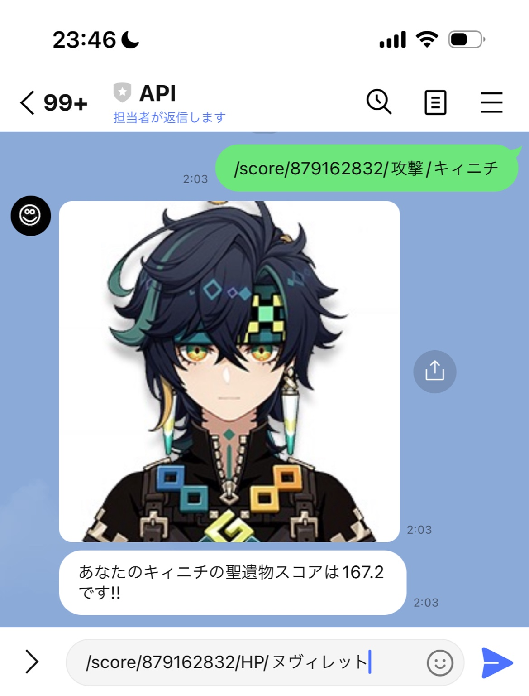
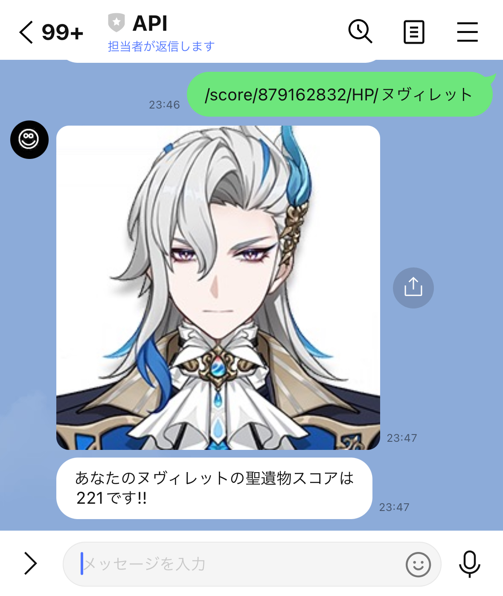

# Genshin LINE Bot の README

このプロジェクトは、`enka.network` のデータに基づいて Genshin Impact プレイヤーにさまざまな機能を提供する LINE ボットを実装しています。ボットは Google Apps Script で作成されており、LINE Messaging API および `enka.network` API と連携して、ユーザーに有用な情報を提供します。
https://liff.line.me/1645278921-kWRPP32q/?accountId=864weplb
実際のbotです。

  **具体的な使用例**:

  1. `/score/879162832/攻撃/キィニチ` コマンドの使用例：
     
  2. `/score/879162832/HP/ヌヴィレット` コマンドの使用例：
     

## 機能

- **プレイヤーステータスの取得**: ボットはプレイヤーのニックネーム、レベル、世界ランクなどの情報を取得して表示します。
- **聖遺物スコア計算**: ユーザーのリクエストに基づいて聖遺物のスコアを計算し、表示します。
- **ChatGPT との連携**: ボットは OpenAI の ChatGPT を使用して自然言語で質問に回答します。
- **日本語データの取得**: Enka Network から日本語データを取得し、キャラクター名やゲーム内のデータを正確に翻訳します。
- **ログの記録**: すべてのユーザーのやり取り（コマンドと応答）を Google スプレッドシートに記録します。
  

## セットアップ手順

1. **Google Apps Script**

   - このプロジェクトは Google Apps Script 上で動作します。Google Apps Script エディタを開き、ソースコードをコピーし、Google スプレッドシート ID (`SPREADSHEET_ID`) やその他の定数（API キーなど）を必要に応じて変更してください。

2. **環境変数**

   - プレースホルダ（`SPREADSHEET_ID`、`ChatGPTKEY` など）を実際の値に置き換えてください。
   - **LINE Messaging API**: LINE Developers Console から API キーを取得してください。
   - **OpenAI API**: ChatGPT を使用するために OpenAI から API キーを取得してください。

3. **スプレッドシートのセットアップ**

   - 以下のシートを含む Google スプレッドシートを作成してください。
     - `genshin`: プレイヤーデータを保存します。
     - `honyaku`: キャラクター名と ID の翻訳を保存します。
     - `character`: Enka Network から取得した Genshin Impact のキャラクターデータを保存します。
     - `chatgpt`: ChatGPT のリクエストと応答を記録します。
     - `message`: ユーザー、メッセージ、ボットの応答を記録します。

4. **スプレッドシート ID の取得**

   - 作成した Google スプレッドシートを開き、URL の一部からスプレッドシートの ID を取得してください。URL は次のような形式になっています：
     ```
     https://docs.google.com/spreadsheets/d/{スプレッドシートID}/edit
     ```
   - `{スプレッドシートID}` の部分がスプレッドシートの ID です。

5. **API の権限**

   - Google Apps Script プロジェクトに `UrlFetchApp` を使用して外部 API への HTTP リクエストを行う権限があることを確認してください。
   - Google スプレッドシートの読み書き権限を設定してください。

6. **キャラクターと翻訳データの取得**

   - Google Apps Script エディタで、次の関数を実行してキャラクターデータと翻訳データをスプレッドシートに保持します。
     - `fetchCharacterData()`: キャラクター情報を取得し、`character` シートに保存します。
     - `fetchAndFilterJapaneseData()`: 日本語データを取得し、`honyaku` シートに保存します。

## 使用方法

この部分では、LINE ボットでの操作方法について説明します。ユーザーは LINE のチャット画面で以下のコマンドを使用してボットとやり取りできます。

- **一般的なコマンド形式**: ユーザーのコマンドは `/` から始まり、特定のボット機能にアクセスするための引数を含むことができます。
  
  - `/help`: 利用可能なコマンドと例を表示します。
  - `/status/(あなたのUID)`: 指定された UID に基づいてプレイヤー情報を取得して表示します。
  - `/score/(あなたのUID)/(タイプ)/(キャラクター名)`: 特定のタイプ（例: HP, 攻撃）とキャラクターの聖遺物スコアを計算して表示します。


- **一般的なコマンド形式**: ユーザーのコマンドは `/` から始まり、特定のボット機能にアクセスするための引数を含むことができます。

  - `/help`: 利用可能なコマンドと例を表示します。
  - `/status/(あなたのUID)`: 指定された UID に基づいてプレイヤー情報を取得して表示します。
  - `/score/(あなたのUID)/(タイプ)/(キャラクター名)`: 特定のタイプ（例: HP, 攻撃）とキャラクターの聖遺物スコアを計算して表示します。

- **ChatGPT との連携**

  - ユーザーメッセージがどのコマンドにも一致しない場合、OpenAI の ChatGPT モデルによってメッセージが処理され、応答が生成されます。
  - API 制限を避けるため、ChatGPT のリクエスト数は 1 日あたり最大 500 回に制限されています。

## 機能概要

1. **doPost(e)**: LINE からのメッセージを処理し、コマンドを処理して応答を作成します。
2. **getUserName(userId)**: LINE ユーザー ID に基づいてユーザーの表示名を取得します。
3. **writeMessageToSheet(userName, userMessage, replyMessage)**: メッセージを Google スプレッドシートに記録します。
4. **getuserData(genshinID)**: ユーザーの Genshin Impact UID に基づいて `enka.network` からユーザーデータを取得します。
5. **extractPlayerInfo(genshinID)**: JSON レスポンスからプレイヤー情報を抽出してフォーマットします。
6. **fetchCharacterData()**: キャラクター情報を取得し、Google スプレッドシートに保存します。
7. **fetchAndFilterJapaneseData()**: 日本語データを取得し、Google スプレッドシートに保存します。
8. **askChatGPT(question)**: ChatGPT に質問を送り、応答を返します。
9. **extractPictURL(genshinID, num)**: キャラクターの画像 URL を取得します。

## 制限事項

- ボットは `enka.network` の Genshin Impact データに依存しています。ユーザーのデータが `enka.network` に登録されていない場合、一部のコマンドは機能しません。
- 現在、日本語で利用可能なデータのみをサポートしています。

## 将来の改善点

- API コールに対するより強力なエラーハンドリングを追加。
- `/help` コマンドを拡充し、より詳細な例や機能を追加。
- 頻繁にアクセスされるプレイヤーデータの API リクエスト回数を減らすためにキャッシュを実装。

## コントリビューション

1. リポジトリをフォークしてください。
2. 新しい機能ブランチを作成してください。
3. 変更をコミットしてください。
4. 変更内容を説明するプルリクエストを開いてください。

## ライセンス

このプロジェクトは MIT ライセンスの下で提供されています。

## クレジット

- **Enka Network**: Genshin Impact のプレイヤーおよびキャラクターデータを提供。
- **OpenAI**: 自然言語処理に使用される ChatGPT モデルを提供。
